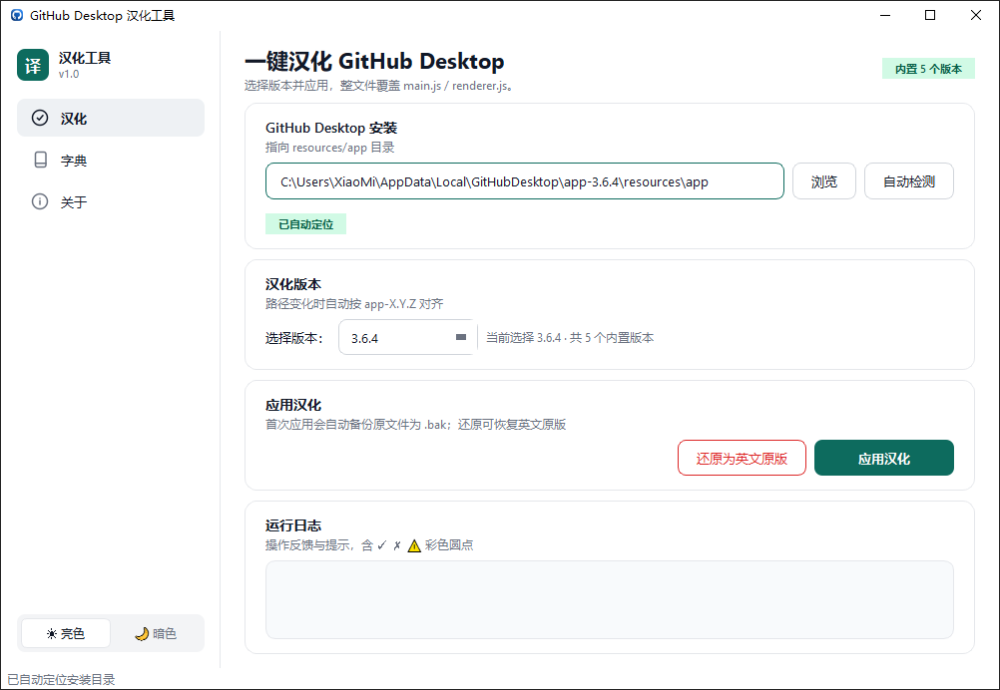

# GitHub Desktop 中文汉化工具

  

> 一个 GitHub Desktop 中文本地化工具。
> 内置 [743859910](https://github.com/743859910/GitHub_Desktop_Simplified_Chinese) 提供的
> **3.6.0 – 3.6.4 共 5 个最新版本**成品汉化（`main.js` / `renderer.js` 整文件替换）；
> 旧版 3.5.0–3.5.9 可由用户自行放入 EXE 同级 `dictionaries/` 目录扩展，
> 双击即用，无需安装 Python、不联网、不自动更新。



⚠️ **免责声明**：本项目与 GitHub, Inc. / Microsoft 无任何关联，非官方产品，未获其背书。
所有修改仅作用于**你本机已安装的 GitHub Desktop 文件**，请自行承担使用风险。

---

## 一、汉化补丁来源（上游 743859910 项目）

本工具的翻译内容**完整源自**
[`743859910/GitHub_Desktop_Simplified_Chinese`](https://github.com/743859910/GitHub_Desktop_Simplified_Chinese)
（MIT License，© 2008–2026 743859910 / 我只是你的过客工作室），并已按 MIT 条款保留其版权与许可声明
（见 [LICENSE](LICENSE)）。

### 上游项目简介（节选自其 README）

- **项目**：GitHub Desktop 简体中文汉化补丁包
- **支持平台**：Linux / macOS / Windows
- **支持版本**：GitHub Desktop **3.5.0 – 3.6.4**
- ⚠️ **重要**：请保持 GitHub Desktop 版本与汉化补丁版本**严格对应**，否则汉化后可能报错或打不开。

> 上游最近更新：**3.6.4（2026-08-14）** —— 将 Git for Windows 更新至 v2.53.0.windows.4、Git 凭证管理器更新至 2.9.0。

### 上游手动汉化方法（供参考 / 非 Windows 用户）

> 上游项目采用「把对应平台的 `main.js` / `renderer.js` 拷贝替换到本地 GitHub Desktop 资源目录」的方式：

- **Windows**：复制到
  `C:\Users\【用户名】\AppData\Local\GitHub Desktop\app-【版本】\resources\app`（替换前请务必备份原文件）
- **macOS**：复制到 `/Applications/GitHub Desktop.app/Contents/Resources/app`
- **Linux**：复制到 `/usr/lib/github-desktop/resources/app`

> 本工具（GUI/EXE）已把上述手动步骤**自动化**：自动定位安装目录、一键整文件替换、自动备份与还原，无需手动复制。

---

## 二、功能特性（桌面版 GUI / 单文件 EXE）

- 🔍 **自动定位** GitHub Desktop 安装目录（默认 `%LOCALAPPDATA%\GitHubDesktop\app-*\resources\app`），并自动识别已安装版本。
- ✅ **一键汉化**：在首页**下拉选择版本**（内置 3.6.0 – 3.6.4 共 5 个，旧版可经本地字典目录扩展），自动备份原文件 `.bak` 后整体替换 `main.js` / `renderer.js`。
- ↩️ **一键还原**：从 `.bak` 恢复英文原版。
- 📦 **多版本内置**：最新 5 个（3.6.0–3.6.4）GitHub Desktop 汉化版本随 EXE 打包，旧版（3.5.0–3.5.9）可由本地 `dictionaries/` 目录扩展，源自 743859910 的 MIT 整文件补丁，纯离线、不联网、不自动更新。
- 🔎 **校验内置版本**：在「字典」页可一键校验 5 个内置版本的完整性（每个版本均含非空 `main.js` / `renderer.js`）；本地放入的旧版也会一并出现。
- 🧩 **自定义新版本**：当 GitHub Desktop 推出内置尚未覆盖的新版本，可从字典项目下载该版本目录（含 `main.js` + `renderer.js`）放入本地 `dictionaries/<版本>/`，工具自动纳入并优先使用。
- 🖥️ 同时提供 **命令行版** `cli.py`（脚本化 / 高级用户）。

### 界面三页

- **首页（汉化）**：自动检测路径 + 版本下拉 + 应用 / 还原
- **字典**：内置版本列表（本地覆盖标记）、打开本地字典目录、校验内置版本、自定义新版本 5 步指引
- **关于**：项目主页 + 字典项目主页链接

---

## 三、快速使用（桌面版 EXE，推荐普通用户）

### 1. 直接使用（已构建好的 EXE）

把 `exe` 放到任意位置双击即可。

- 首次运行：点「自动检测」填好路径 → 在「版本」下拉框选择**与你的 GitHub Desktop 完全相同**的版本号 → 点「应用汉化」即可（内置 3.6.0 – 3.6.4 共 5 个版本；若你的版本较旧，见下方「自定义新版本」放入本地字典）。
- 若 GitHub Desktop 装在 `Program Files` 等需管理员权限的目录，右键「以管理员身份运行」本 EXE 即可。

### 2. 命令行版（cli.py）

```bash
python gui/cli.py locate                      # 自动检测 GitHub Desktop 安装目录
python gui/cli.py versions                    # 列出所有内置汉化版本（共 5 个，3.6.0–3.6.4）
python gui/cli.py apply --version 3.6.4       # 应用指定版本汉化
python gui/cli.py apply --path "C:\Users\Me\AppData\Local\GitHubDesktop\app-3.6.4\resources\app"
python gui/cli.py restore                     # 还原为英文原版
```

### 3. 自行打包（源码 → EXE）

需要一台装有 **Python 3.8+** 的 Windows 机器（Qt6 经 PySide6 安装，无需系统 Tk）：

```bat
cd gui
build.bat
```

脚本会：建隔离虚拟环境 → 安装 PyInstaller + PySide6 → 把最新 5 个版本（3.6.0–3.6.4）的 `dictionaries/` 子树
（各含 `main.js` / `renderer.js`）一并打进单文件 → 产出 `gui\dist\github-desktop-zh-1.0.0.exe`（Windows 专用，27.13 MB / 28,443,698 字节，已被 .gitignore 忽略）。
同时可用 `cli.py` 直接跑命令行（无需打包）。

---

## 四、自定义新版本（当官方发布内置未覆盖的新版）

当 GitHub Desktop 推出新版本（如 3.7.0）而内置尚未覆盖，或你使用的是内置未打包的旧版（3.5.0–3.5.9）时：

1. 在 GitHub Desktop 的「帮助 → 关于 GitHub Desktop」中查看你的版本号（如 3.7.0）。
2. 前往字典项目（743859910 仓库）下载 / 适配该版本的 `main.js` + `renderer.js`。
3. 点击工具「打开本地字典目录」，在弹出的 `dictionaries/` 下新建与版本号完全一致的子目录（如 `3.7.0`）。
4. 把 `main.js` + `renderer.js` 放入该子目录，重启本程序。
5. 版本列表会出现该版本并标记「（本地）」，在首页选中即可一键应用（本地优先于内置）。

---

## 五、原理

1. GitHub Desktop 的界面文案以**英文字符串字面量**形式硬编码在打包后的 `main.js`（菜单 / 进程层）与 `renderer.js`（UI 层）中。
2. 上游 743859910 已将这些文件**整份翻译为中文**（每个支持版本一份成品）。
3. 本工具按选定版本，将对应成品 `main.js` / `renderer.js` **整体替换**到 GitHub Desktop 的 `resources/app`（先备份 `.bak`），100% 还原该版本官方汉化。
4. 平台差异：`__DARWIN__` 在 macOS 下使用另一套文案，故字典按平台分流（本工具内置 Windows 成品）。

---

## 六、目录结构

```
.
├── README.md
├── LICENSE                  # MIT（含本项目与 743859910 双版权声明）
├── zhtool.py                # 底层引擎（自动定位 / 文件解析 / 完整性清单）
├── dictionaries/            # 内置汉化（整文件成品，源自 743859910 的 MIT 补丁）
│   ├── 3.5.0/ … 3.6.4/     # 15 个版本（3.5.0–3.6.4；EXE 内置最新 5 版 3.6.0–3.6.4，旧版可由本地 EXE 同级 dictionaries/ 扩展），各含 main.js + renderer.js
├── gui/                     # 桌面版（图形界面 + 单文件 EXE + 命令行）
│   ├── app.py               # PySide6/Qt6 图形界面主程序（Windows，3 页）
│   ├── cli.py               # 命令行版（与 GUI 共享 zhcore）
│   ├── zhcore.py            # 无 UI 依赖核心逻辑（多版本应用 / 还原 / 校验 / 本地字典）
│   ├── assets/icon.ico      # 程序图标（官方 GitHub octicon 白猫）
│   ├── github-desktop-zh-1.0.0.spec  # PyInstaller spec 文件
│   └── build.bat            # PyInstaller 单文件打包脚本
```

---

## 七、已知限制

- 本工具内置 **Windows** 成品汉化，为 **Windows 专用**；macOS / Linux 用户可直接使用上游项目（743859910）的手动方法。
- 汉化覆盖率 = 上游成品文件的完整度；**请保持 GitHub Desktop 版本与所选汉化版本一致**，否则可能报错或打不开。
- 官方自动更新会覆盖 `resources/app`：重新应用一次对应版本即可；「还原」可恢复英文原版。
- 自动更新若改变 `resources/app` 的**目录名**（如 `app-3.6.4` → `app-3.6.5`），重新「自动检测」即可。

---

## 八、致谢

- 汉化内容衍生自 [743859910/GitHub_Desktop_Simplified_Chinese](https://github.com/743859910/GitHub_Desktop_Simplified_Chinese)
  （MIT，© 2008–2026 743859910 / 我只是你的过客工作室）。
- 如果您觉得有用，**欢迎给上游项目点亮一颗 Star ⭐** 以示鼓励！

---

## 许可证

[MIT](LICENSE) © 2026 heylumen · 汉化内容衍生自 © 2008–2026 743859910（我只是你的过客工作室）
